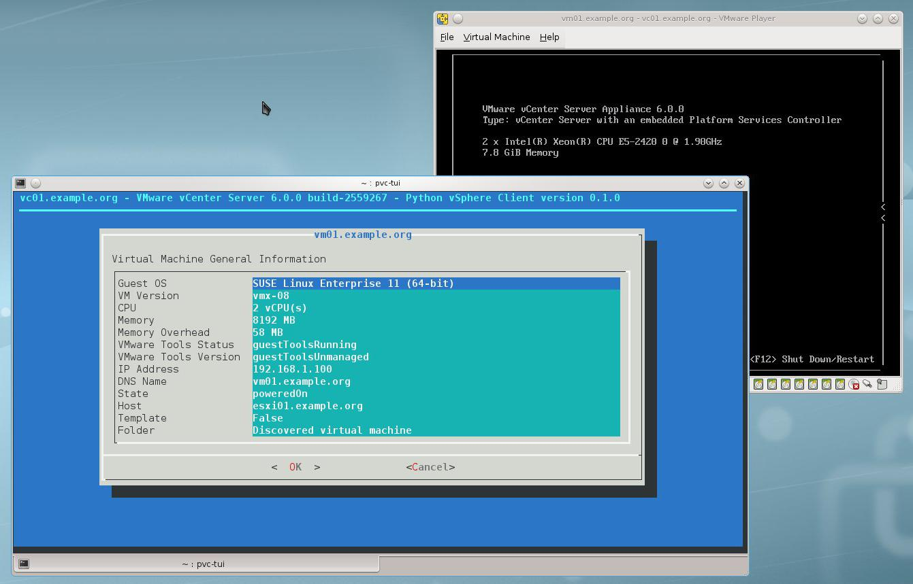

Python vSphere Client with a dialog(1) interface
================================================

PVC is an interactive text-mode VMware vSphere Client with a
`dialog(1)`_ interface for GNU/Linux systems built on top of the
`pyVmomi`_ VMware vSphere API Python bindings.

Using PVC allows you to quickly navigate in your VMware vSphere
environment and perform common tasks against various VMware vSphere
Managed Entities.

PVC is Open Source and licensed under the `BSD License`_.

Status
======

Experimental. PVC is in early development stage. Using PVC in a
production environment is not (yet) recommended.

Contributions
=============

PVC is hosted on `Github`_. Please contribute by reporting issues,
suggesting features or by sending patches using pull requests.

Bugs
====

Probably. If you experience a bug issue, please report it to the
PVC issue tracker on `Github`_.

Getting Started
===============

Getting started with PVC is easy - simply go over the
:ref:`installation` and :ref:`configuration` pages, which
provide all the details about how to install and configure PVC.

Make sure to also check the :ref:`examples` page, which contains
examples and screenshots of using PVC in a VMware vSphere environment.

.. _`dialog(1)`: http://invisible-island.net/dialog/
.. _`pyVmomi`: https://github.com/vmware/pyvmomi
.. _`BSD License`: http://opensource.org/licenses/BSD-2-Clause
.. _`Github`: https://github.com/dnaeon/pvc

Contents
========

.. toctree::
   :maxdepth: 2

   installation

   .. toctree::
   :maxdepth: 2

   configuration

   .. toctree::
   :maxdepth: 2

   examples
